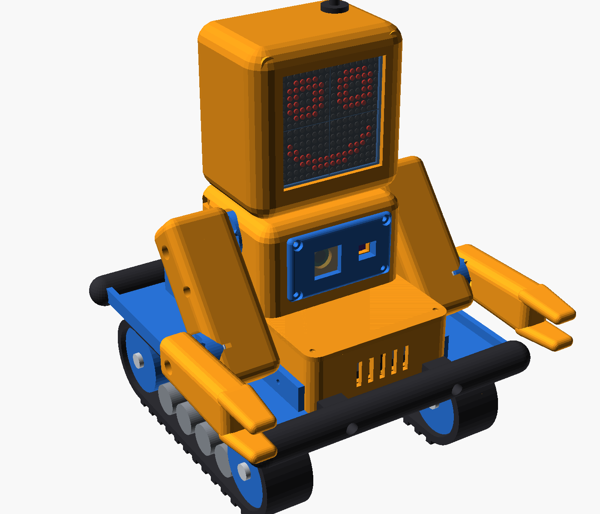

# Tank: a tough Arduino robot toy

A kid-proof robot on a bought tank chassis, with two arms that click instead of
breaking, a 16 x 16 LED face on a head fixed to the body, a Wi-Fi camera and a distance
sensor in the chest, and a phone control page. It reuses the electronics from
the Otto DIY "fat version" (Nano + shield, servos, LED matrix, buzzer).

| Folder | What's in it |
|---|---|
| [docs/BUILD.md](docs/BUILD.md) | parts list, printing, wiring, assembly, setup |
| [hardware/](hardware) | OpenSCAD source (`robot.scad`, `config.scad`), `stl/`, `renders/`, `export.sh` |
| [firmware/robot_body](firmware/robot_body) | Arduino Nano: face, arms, tracks, sensor, modes, `my_program.h` |
| [firmware/robot_cam](firmware/robot_cam) | ESP32-CAM: Wi-Fi, live video, phone control page |
| [tools/](tools) | `faces.txt` (draw faces) and `make_faces.py` |
| [concepts/](concepts) | the earlier concept rounds |
